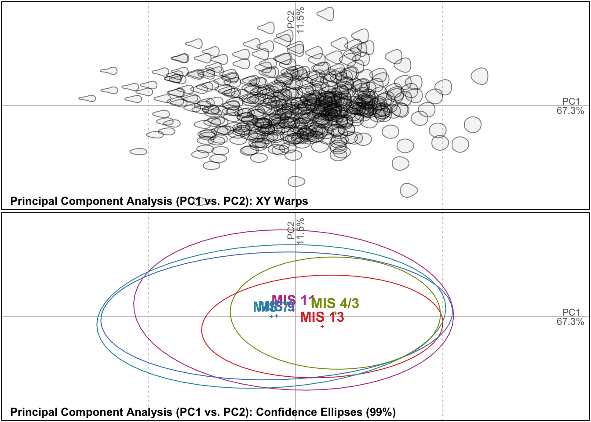
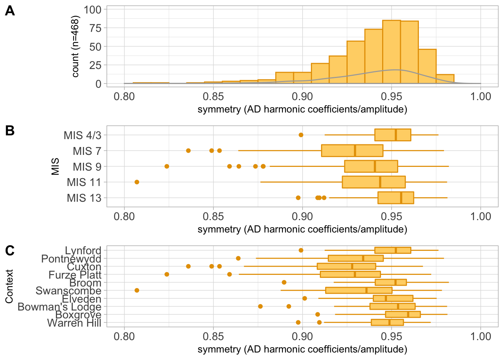

The data has 468 specimens

(\#fig:figure-1)An exploration of biface shape and Marine Isotope Stage (MIS) through an elliptic Fourier principal component analysis (EFA-PCA). Confidence ellipses are here set to two-thirds (66.66%)

(ref:figure-3-caption) An examination of symmetry (AD harmonic coefficients/amplitude) through a histogram (a), and two box-and-whisker plots (Tukey style) examining symmetry against individual Marine Isotope Stage (b), and against individual sites (c)

(\#fig:figure-3)(ref:figure-3-caption)

Please see Figure \@ref(fig:figure-3)

MIS        count        mean          sd         min         max         cv
--------  ------  ----------  ----------  ----------  ----------  ---------
MIS 13        99   0.9512606   0.0167777   0.8975688   0.9813482   1.763735
MIS 11       115   0.9391475   0.0263619   0.8070230   0.9811449   2.807001
MIS 9        119   0.9346092   0.0271371   0.8238223   0.9821345   2.903572
MIS 7         87   0.9248606   0.0286200   0.8359227   0.9793912   3.094520
MIS 4/3       48   0.9497157   0.0173026   0.8991385   0.9762970   1.821867

